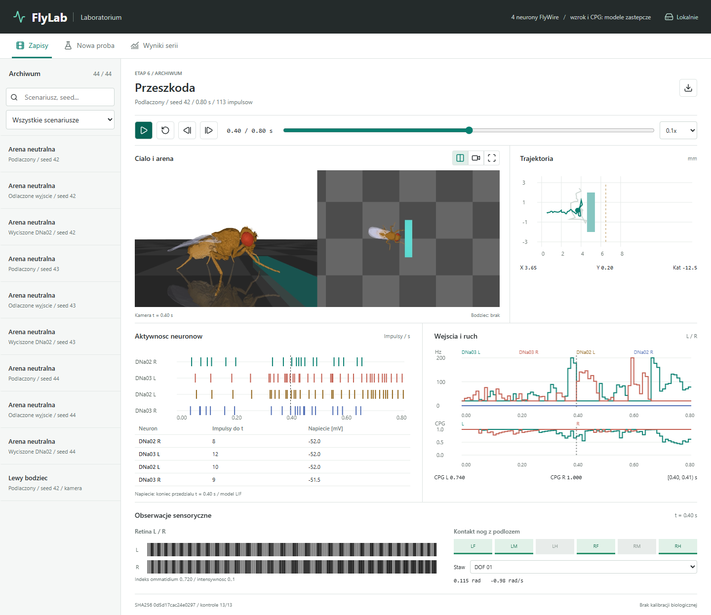

# FlyLab

Lokalne laboratorium eksperymentow z modelem muszki: biomechanika
NeuroMechFly/FlyGym w MuJoCo, model neuronowy Brian2 i panel przegladarkowy.

**Stan: wszystkie 8 etapow zakonczone technicznie; walidacja biologiczna
pozostaje otwarta.** Zamknieta petla uzywa czterech neuronow DNa03/DNa02,
czterech rzeczywistych skierowanych par i 645 kontaktow synaptycznych FlyWire.
Nie jest to biologicznie zweryfikowana symulacja calego mozgu. Wejscia
wzrokowe i sterowanie CPG sa modelami zastepczymi; nie ma VNC, wechu ani lotu.



## Co dziala

- Zamknieta petla obraz -> obwod neuronowy -> amplitudy CPG -> biomechanika.
- Serie wielu seedow, bodzce kierunkowe, przeszkoda, pobudzenie i wyciszenie.
- Pauza/wznowienie nowej proby i odtwarzanie zapisow na wspolnej osi czasu.
- Podglad kamer, trajektorii, impulsow, wejsc, kontaktow i propriocepcji.
- Hashe danych, konfiguracji i kodu, kontrole numeryczne oraz testy regresji.
- Oddzielny widok walidacji: zamrozony dobor parametru, niezalezne seedy,
  ablacje, benchmark i wykresy dostepne po weryfikacji wynikow.

Seria etapu 6: 44 proby, trzy seedy. Reakcja kierunkowa: 6/6 zgodnych prob.
W arenie z przeszkoda bramke osiagnieto w 0/3 prob z podlaczonym obwodem
i 2/3 bez jego wplywu. Wynik negatywny pozostaje w raporcie; kontroler
chodu nie jest dowodem poprawnego modelu mozgu.

Etap 8: 68 prob i niezalezne seedy walidacyjne. Wybrana redukcja kroku 0.35
obnizyla sredni koszt zadania skretu z 34.03 do 4.88 deg-eq na trzech nowych
seedach. Przeszlo 790 kontroli prob, 22 kontrole serii i 11 kontroli osobnego
benchmarku neuronowego. To kalibracja inzynierska do celu +/-30 stopni,
nie dopasowanie do pomiarow zwierzecia. [Wyniki i ograniczenia](VALIDATION.md).

## Wymagania

Sprawdzone lokalnie: Windows, Python 3.13.7, FlyGym 2.1.0, MuJoCo 3.9.0,
Brian2 2.10.1, OpenGL i CPU. Skrypty renderowania uzywaja fontu Arial z Windows;
inne systemy nie sa jeszcze przetestowane. Obliczenia sa offline, nie w czasie
rzeczywistym. Panel nie wymaga Node.js, kluczy API ani zewnetrznych uslug.

```powershell
python -m venv .venv-body
.\.venv-body\Scripts\python.exe -m pip install -r requirements-simulation.lock.txt
.\.venv-body\Scripts\python.exe -m unittest discover -s tests
```

79 testow przechodzi w zweryfikowanym srodowisku. Powyzej instaluje sie
przypiete zaleznosci; nie jest to gwarancja zgodnosci z kazda platforma.

## Dane i pierwszy eksperyment

Repozytorium zawiera kod oraz male wejscia testowe, ale **nie zawiera pelnych
tabel FlyWire, srodowiska Pythona ani lokalnych wynikow serii**. Panel wymaga
archiwum etapu 6, ktore nalezy odtworzyc przed pierwszym uruchomieniem.
Przygotuj lokalne tabele wydania v783:

```text
connections_princeton.csv.gz
neurons.csv.gz
names.csv.gz
visual_neuron_types.csv.gz
classification.csv.gz
processed_labels.csv.gz
```

Tabele CSV pochodza z eksportow [FlyWire Codex](https://codex.flywire.ai/).
[Wydanie v783 w Zenodo](https://zenodo.org/records/10676866) zawiera pokrewne
pliki Feather/NPY; nie nalezy jedynie zmieniac ich rozszerzen na CSV.
Importer czyta powyzszy schemat CSV/GZIP. Dane pozostaja w katalogu lokalnym:

```powershell
$data = "$env:USERPROFILE\Downloads\mind"
.\.venv-body\Scripts\python.exe flywire_data.py --data-dir $data
.\.venv-body\Scripts\python.exe behavior_experiment.py --data-dir $data
.\.venv-body\Scripts\python.exe lab_launch.py
```

Seria liczy 44 proby, a nie jeden krotki test. W razie przerwania:

```powershell
.\.venv-body\Scripts\python.exe behavior_experiment.py --data-dir $data --resume
```

Pozniej wystarczy dwuklik `Uruchom-FlyLab.cmd`. Panel dziala domyslnie na
`http://127.0.0.1:8767`. Nasluchuje tylko lokalnie; nie wystawiac go publicznie.
Bez danych mozna uruchomic testy jednostkowe lub sam test biomechaniki:

```powershell
.\.venv-body\Scripts\python.exe body_smoke.py --duration 1 --seed 42
```

## Dokumentacja

- [Plan i wyniki etapow](PLAN.md)
- [Walidacja, kalibracja inzynierska i benchmark](VALIDATION.md)
- [Panel i jego zegary](LAB_PANEL.md)
- [Serie testow zachowania](BEHAVIOR_TESTS.md)
- [Polaczenie mozgu i ciala](CLOSED_LOOP.md)
- [Sensoryka](SENSORY_MODEL.md)
- [Model neuronowy i ograniczenia](BRAIN_MODEL.md)
- [Pochodzenie danych i zaleznosci](THIRD_PARTY.md)

Zapisane w dokumentacji liczby odnosza sie do lokalnych zweryfikowanych prob,
nie do badan na zwierzetach. Male pliki w `outputs/flywire_demo/` sluza
starszej eksploracji i importowi testowemu, a nie sterowaniu biomechanika.

## Walidacja

Protokol etapu 8 mozna uruchomic osobno:

```powershell
.\.venv-body\Scripts\python.exe validation_experiment.py
```

68 prob, seedy doboru 101-102 i walidacji 201-203. Wznowienie przez `--resume`;
panel "Walidacja" pokazuje postep i zakonczony raport. Dobor parametrow do
zadania tego symulatora nie jest kalibracja biologiczna.
