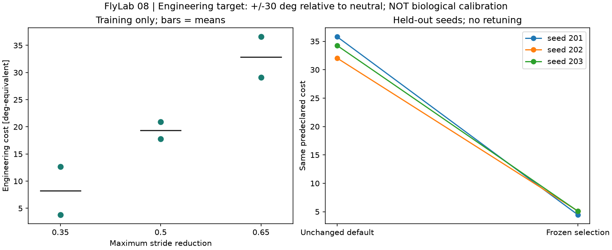
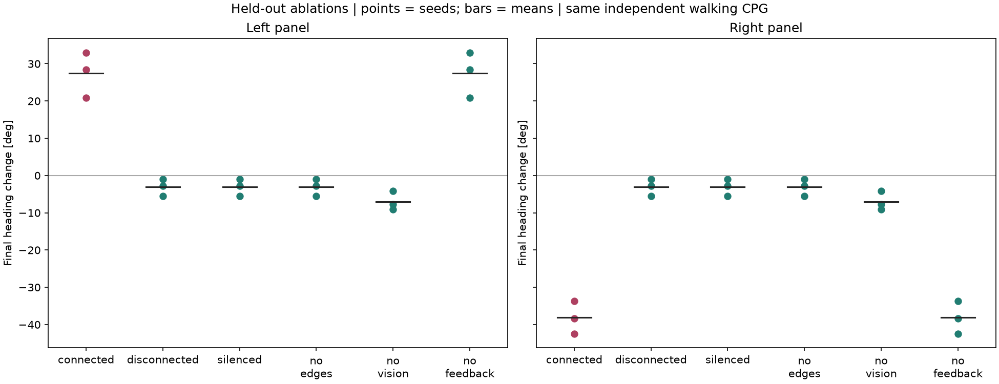

# Etap 8: walidacja techniczna i wydajnosc

Ten protokol testuje model, nie zywe zwierze. Kalibracja oznacza tutaj dobor
sily zastepczego adaptera ruchowego do zadania inzynierskiego. Nie dopasowujemy
parametrow neuronow do nieposiadanych pomiarow biologicznych i nie nazywamy
czterokomorkowej petli symulacja calego mozgu.

## Wynik z 2026-10-09

**Status: zakonczony technicznie.** Wszystkie 68 prob zostalo wykonanych.
Przeszlo 790 kontroli pojedynczych prob, 22 kontrole calej serii i 11 kontroli
osobnego zestawu neuronowego. 79 testow automatycznych oraz `pip check` przeszlo.
Zweryfikowano hashe 340 artefaktow prob i pozostalych plikow raportu.
Gotowy panel sprawdzono w Chrome: cztery widoki przy szerokosciach 320, 390,
768, 1440 i 1920 px, bez poziomego przepelnienia strony i bledow JavaScript.
Oba wykresy sprawdzono wizualnie i pikselowo, eksport JSON porownano z raportem,
a symulowany blad integralnosci poprawnie ukryl wyswietlane wyniki.

| Miara | Wynik |
| --- | --- |
| Wybrana redukcja kroku | 0.35; najlepsza z trzech przetestowanych wartosci |
| Koszt treningowy: 0.35 / 0.50 / 0.65 | 8.23 / 19.36 / 32.85 deg-eq |
| Koszt walidacyjny: domyslny / wybrany | 34.03 / 4.88 deg-eq |
| Seedy walidacyjne: domyslny -> wybrany | 201: 35.80 -> 4.46; 202: 32.04 -> 5.11; 203: 34.26 -> 5.08 |
| Upadki w tej serii | 0/68; tylko arena plaska, nie test pokonywania przeszkod |
| Dwa powtorzenia | Stan fizyczny/neuronowy identyczny; roznica retiny maks. 0.00006791 |
| Mediana czasu pracownika | 21.15 s na 0.8 s modelu, czyli 26.44 s/s |
| Maksymalna probkowana suma RSS pracownika | okolo 507 MiB, bez procesu nadrzednego i GPU |
| Osobny pelny graf | 139 255 neuronow, 3 732 460 par; 50 ms modelu, 725 impulsow |
| Czas Brian2 dla pelnego grafu | 3.18 s z kompilacja; nie obejmuje importu ani eksportu |
| RSS pracownika zestawu neuronowego | okolo 564 MiB; nie sama alokacja grafu |

Wyciszenie DNa02, odciecie wyjscia i usuniecie synaps odtwarzaja identyczna
fizyke CPG. Bez modulacji wzrokowej lewy i prawy panel daja ten sam przebieg.
Kontrole pokazuja wplyw modelowanego obwodu na modulacje chodu, ale nie
potwierdzaja biologicznej poprawnosci tego obwodu.

Wyniki wznowiono po przerwaniu od 32 ukonczonych prob. Pierwotny pomiar RAM,
ktory obserwowal tylko startowy proces Windows, zachowano osobno jako
diagnostyczny; nie jest czescia tych 68 prob. Poprawiony pomiar obejmuje
drzewo pracownika i jest sprawdzany testem dodatkowej alokacji 64 MiB.
Czasy sa pomiarami lokalnymi przy zmiennym obciazeniu, nie gwarancja wydajnosci.

[Podsumowanie JSON](docs/validation-stage8.json) zawiera konfiguracje, wyniki
kazdego seeda, hashe kodu i ograniczenia, bez prywatnych lokalnych sciezek.
Pelne pliki NPZ pozostaja lokalnie i mozna je odtworzyc ponizszym protokolem.





## Protokol przed uruchomieniem

Konfiguracja: `experiments/validation-suite.json`. Czas, fizyka, bodziec i model
LIF pozostaja takie jak w `experiments/behavior-suite.json`: 0.8 s, krok fizyki
0.1 ms, aktualizacja sensoryki/sterowania co 10 ms, bodziec od 0.1 s.

- Dobor: seedy 101 i 102, kazdy z bodzcem neutralnym, lewym i prawym.
- Kandydaci: `maximum_stride_reduction` = 0.35, 0.50, 0.65. Pozostale parametry
  pozostaja niezmienione. Jest to 18 prob, bez filtrowania nieudanych zachowan.
- Cel: koncowy skret lewo +30 stopni, prawo -30 stopni wzgledem proby
  neutralnej tego samego seeda. To arbitralny cel testowy, nie wynik pomiaru.
- Koszt seeda: sredni bezwzgledny blad obu skretow + 0.25 * bezwzgledny
  neutralny dryf kierunku + 180 * odsetek upadkow w trzech probach.
  Upadek zachowuje definicje etapu 6: minimum osi z tulowia < 0.5.
- Wybor: najmniejszy sredni koszt na dwoch seedach treningowych. Remisy
  rozstrzyga kolejnosc kandydatow w konfiguracji.
- `selection.json` zostaje zapisany z hashami wynikow treningowych **przed**
  pierwsza proba walidacyjna. Nie wybieramy ponownie po obejrzeniu walidacji.
- Walidacja: nowe seedy 201, 202, 203; profil domyslny i wybrany, po trzy
  bodzce. Dalsze 30 prob to piec ablacji dla obu stron i wszystkich seedow.
  Dwa powtorzenia sprawdzaja odtwarzalnosc. Lacznie 68 prob.

Mniejszy koszt na walidacji nie jest warunkiem zaliczenia infrastruktury.
Pogorszenie lub brak poprawy musi pozostac widoczne. Nie ma testow istotnosci
ani wnioskowania o populacji zwierzat: seedy to warianty jednego modelu.

## Co usuwaja ablacje

| Warunek | Interwencja | Co pozostaje |
| --- | --- | --- |
| `connected` | Brak ablacji | Obraz, cztery neurony, adapter i CPG |
| `disconnected` | Wyjscie adaptera nie moduluje CPG | Obwod nadal liczy impulsy; CPG dostaje [1,1] |
| `silenced` | Oba DNa02 wyciszone przez cala probe | Wejscie do DNa03 oraz niezalezny chod CPG |
| `no_edges` | Usuniete wszystkie cztery istniejace krawedzie | Te same komorki i wejscia Poissona |
| `no_vision` | Zmiany obrazu nie moduluja wejsc | Toniczne 20 Hz po obu stronach, synapsy i CPG |
| `no_feedback` | Usuniete dwie krawedzie DNa02 -> DNa03 | Dwie krawedzie DNa03 -> DNa02, 610 kontaktow |

Graf bazowy ma 645 kontaktow. Ablacja nie tworzy ani nie odwraca synaps.
Kontrole `disconnected`, `silenced`, `no_edges` powinny odtwarzac identyczne
qpos dla tego samego seeda. Dwie strony bodzca przy `no_vision` powinny dawac
identyczna dynamike, poniewaz panele wizualne nie maja kolizji.

Kontroler CPG pochodzi z [oficjalnego FlyGym](https://neuromechfly.org/tutorials/4a_cpg_controller/).
Generuje fazy krokow i sterowanie stawami niezaleznie od badanego fragmentu
mozgu. Porownania identyfikuja wplyw interwencji na skret; nie dowodza, ze mozg
odtwarza biologiczny generator chodu. Seed CPG i seed neuronow nadal zmieniaja
sie razem, wiec nie estymujemy oddzielnych skladowych ich wariancji.

## Uruchomienie i wznowienie

Wymagane sa te same lokalne dane i zaleznosci co dla etapow 5-6. Nie potrzeba
nowych pakietow, kont ani kluczy. Seria moze zajac kilkanascie minut lub wiecej
w zaleznosci od komputera. Kazda proba jest osobnym procesem.

```powershell
.\.venv-body\Scripts\python.exe validation_experiment.py --max-trials 1
.\.venv-body\Scripts\python.exe validation_experiment.py --resume
.\.venv-body\Scripts\python.exe -m unittest discover -s tests
```

`--max-trials` ogranicza liczbe **nowych** prob w danym wywolaniu. Wznowienie
weryfikuje konfiguracje, wersje bibliotek, hashe kodu, danych i wszystkich
ukonczonych artefaktow. Inna konfiguracja/kod wymaga nowego `--output`.
Przerwana proba zostaje obliczona ponownie; ukonczone nie sa powtarzane.
Nie sa zmieniane archiwum etapu 6 ani domyslne ustawienia panelu.

Wybrany profil jest eksportowany do `selected-behavior.json`. Mozna jawnie
uzyc go do nowej kompletnej serii zachowania, rowniez z przeszkoda:

```powershell
.\.venv-body\Scripts\python.exe behavior_experiment.py --config outputs/flylab/validation-stage8/selected-behavior.json --output outputs/flylab/behavior-selected
```

To oddzielny eksperyment, nie zostal wykonany przez sam protokol etapu 8.
Wybor pod katem skretu nie gwarantuje lepszego pokonywania przeszkod.

## Pomiary wydajnosci

- Kazda proba uruchamiana w nowym procesie. `worker_wall_s` obejmuje start
  Pythona, importy, przygotowanie ciala, sensoryke, neurony, fizyke i eksport.
- `body_setup_s` i `episode.wall_s` sa wewnetrznymi pomiarami czesci przebiegu.
  Epizod obejmuje reset, rendering oczu i zapis; nie jest czystym czasem fizyki.
- `wall_s_per_simulated_s` dzieli caly czas pracownika przez 0.8 s. Wynik > 1
  oznacza wolniej niz czas rzeczywisty dla tego protokolu.
- Suma RSS drzewa procesu probkowana co okolo 50 ms, lacznie z procesem
  potomnym Windows, w ktorym faktycznie dziala Python ze srodowiska venv.
  Suma moze podwojnie liczyc wspoldzielone strony. Osobno maksimum working
  set najwiekszego pojedynczego procesu udostepniane przez system Windows.
  To pamiec calego pracownika, nie samych neuronow,
  GPU ani laczna pamiec z procesem nadrzednym/panelem. Probkowanie moze
  przeoczyc krotkie piki; nie podajemy RSS jako dokladnego minimum wymaganego RAM.
- Po serii uruchamiany jest w osobnym procesie zestaw etapu 3: test malej sieci
  oraz trzy przebiegi calego lokalnego grafu przez 50 ms. Jego pomiary nie sa
  pomiarami calego mozgu sterujacego cialem. Krotki test nie przewiduje kosztu
  wielosekundowej dynamiki ani innych wzorcow aktywnosci.

## Artefakty

Katalog domyslny: `outputs/flylab/validation-stage8/`.

- `manifest.json`, `settings.json`, `mapping.json`, `circuit.npz`: pochodzenie,
  konfiguracja, graf i checkpoint.
- `selection.json`, `selected-behavior.json`: zamrozony wybor i profil do
  jawnego uzycia w kolejnych eksperymentach.
- `trials/`: wszystkie zadania, pelne zapisy fizyki/neuronow/sensoryki,
  metryki, kontrole, logi i hashe. Wyniki nie zawieraja wygenerowanych animacji.
- `calibration.png`, `ablations.png`: wykresy rzeczywistych wynikow symulatora.
- `brain-benchmark/`: aktywnosc i raporty oddzielnego benchmarku calego grafu.
- `report.json`: kompletny raport lokalny. `summary.json`: podsumowanie bez
  lokalnych sciezek, gotowe do publikacji; nie zastepuje pelnych zapisow.

## Granica zakonczenia

Etap techniczny mozna zakonczyc po wykonaniu wszystkich prob, kontroli,
benchmarkow i audycie odtwarzalnosci. **Walidacja biologiczna pozostaje otwarta**:
potrzebne sa niezalezne dane o aktywnosci i zachowaniu, skalibrowane parametry
komorek, udokumentowane mapowanie receptorow oraz VNC. Nadal nie ma wechu,
lotu, pelnego mozgu w petli ani dowodu inteligentnego unikania przeszkod.

Dokumentacja wczesniejszych etapow zachowuje ich negatywne wyniki i ograniczenia.
